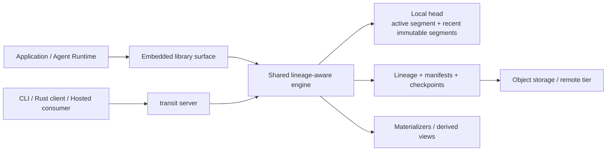
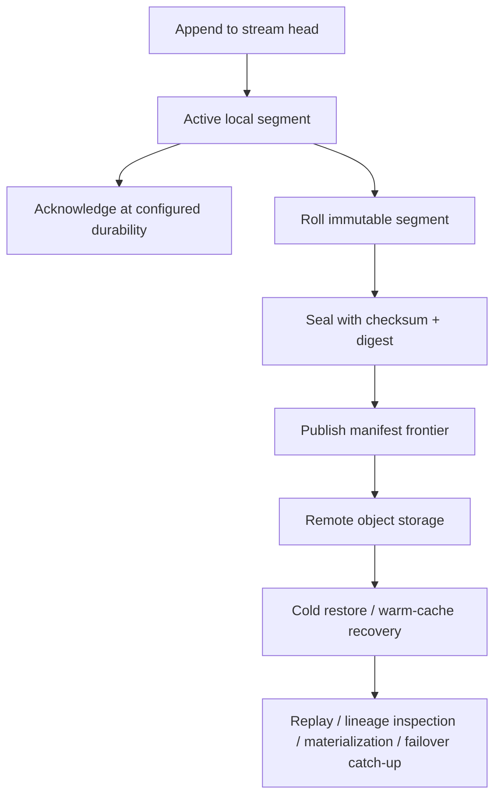

# transit

`transit` is a fresh take on message streaming: a Rust-first, object-storage-native append-only log with native tiered storage, stream lineage, and explicit branch-and-merge semantics.

The project thesis is simple:

- the same engine should run embedded in-process or as a networked server
- object storage should be a first-class persistence layer, not an archival afterthought
- branching and merging streams should be primitives, not application hacks
- append-only history should stay immutable while new branches diverge cheaply
- verifiable lineage should attach to segments, manifests, and checkpoints without bloating every append
- AI agents, model harnesses, and human communication systems should be first-class workloads

## Why Transit

Most streaming systems make a strong trade:

- they are excellent at ordered append and fan-out
- they are weak at representing divergence, experimentation, and conversational lineage
- they rarely treat merge and reconciliation as first-class dataflow operations
- they treat object storage as backup or offload instead of as part of the normal storage plan

`transit` aims at a different center:

- low-latency local append and tail for the hot path
- immutable segments persisted into object storage as part of the normal lifecycle
- stream branches and merges that reuse history without copying bytes
- one storage model that works for embedded runtimes, servers, agents, processors, and operator tools

## Architecture At A Glance

### One Engine, Two Delivery Modes

The point of the architecture is not transport flexibility by itself. It is that embedded and server mode preserve the same lineage, durability, and tiered-storage model.

### Immutable History Lifecycle

This lifecycle is why Transit keeps the local head, immutable manifests, and remote tier explicit instead of hiding them behind one generic "durable" label.

## Core Model

- `record`: immutable bytes plus headers and timestamps
- `stream`: an ordered append-only sequence of records
- `branch`: a child stream created from a parent stream at a specific offset
- `merge`: an explicit reconciliation of two or more stream heads under a declared merge policy
- `lineage`: the DAG formed by branch and merge relationships
- `segment`: an immutable block of ordered records
- `manifest`: metadata that maps streams and branches to their segments across local and remote storage
- `checkpoint`: a proof-bearing envelope that binds a stream head or derived state to immutable history

In `transit`, a branch is not a filtered consumer view. It is its own stream head with explicit ancestry.

In `transit`, a merge should also be explicit. It should create new lineage state with declared parents and merge policy, not silently rewrite history behind the scenes.

## What It Should Enable

The initial target use cases are direct:

- AI model harnesses that need replayable traces, retries, forks, and evaluation provenance
- agent runtimes where one interaction can branch into parallel tool-use or planning paths
- a Slack-like communication system where channels are root streams and threads are native branches
- hosted control planes that treat `transit-server` as the authoritative append and replay surface for consumer-owned records instead of embedding a second local authority store
- systems that need to merge branch results back into a mainline without losing provenance
- stream processing and incremental materialization over branching and merging event histories
- classifier-driven auto-threading, where a model can fork a new branch when a conversation diverges
- remote restore and audit flows that can verify immutable history instead of trusting remote storage implicitly

That auto-threading path is a core design motivator. A classifier should be able to observe a root stream, identify a new thread boundary, and create a child branch anchored to the triggering record without rewriting history.

## Branching, Merging, Materialization

The deeper thesis is not just "logs that can fork." It is "logs that can branch, merge, and feed deterministic derived state."

- Branches let a system diverge cheaply for retries, thread splits, alternate plans, or hypothetical work.
- Merges let those paths reconcile explicitly instead of forcing the application to pretend divergence never happened.
- Materialization lets processors build durable derived state, indexes, views, and caches from that lineage-rich history.

That suggests a product direction beyond a flat append-only log:

- the core engine should own append, branch, merge, lineage, and tiered storage
- materializers and processors may start as an adjacent first-party layer, but they should use the same manifests, checkpoints, and lineage model
- branch and merge semantics should make incremental recompute and branch-local derived state practical instead of expensive
- integrity should bind immutable segments and manifests, then grow into checkpoints and proofs without contaminating the hottest append path

## Design Goals

- Embedded-first core with a server mode layered on the same engine
- Native tiered storage with explicit local-head and remote-object responsibilities
- O(1)-style branch creation relative to ancestor history size
- explicit, inspectable merge operations with deterministic merge policies
- Immutable acknowledged history with no silent rewrites
- staged verifiable lineage from checksums to manifest roots to checkpoints
- incremental materialization over ordered, branching, and merging histories
- Clear durability modes so latency claims and safety claims are comparable
- Benchmarkable behavior for append, replay, cold restore, tailing, and branch-heavy workloads

## Non-Goals

`transit` is not trying to be a general mutable database, a hidden background compactor that rewrites acknowledged history, or a queue that destroys provenance once a consumer advances.

## Current State

This repository is at the bootstrap stage.

Today it contains:

- **Local Engine:** Durable local append, replay, branch, merge, and crash recovery with trailing-byte truncation.
- **Tiered Storage:** Native publication to object storage and cold restore from remote manifests.
- **Failover Stack:** Controlled handoff with lease fencing, automatic leader election via `ElectionMonitor`, and quorum-based durability.
- **Networked Server:** Single-node daemon bootstrap with a framed request/response protocol and logical tail sessions.
- **Integrity:** Staged verification from checksums to manifest roots and lineage checkpoints.
- **Materialization:** Incremental processing with Prolly Tree snapshots and checkpoint-based resume.
- **Clients:** Native Rust client library with replay-driven projection-consumer helpers and a feature-complete CLI for operations and proofs.
- **Verification:** A unified `just screen` path that runs the full suite of human-verifiable missions.

The implementation work now has a real scaffold to grow from instead of needing to reverse-engineer direction later.

## Current Capability Baseline

| Slice | What ships today | Primary proof path |
|-------|------------------|--------------------|
| Local engine | durable append, replay, branch, merge, crash recovery, and `transit status` over a local log root | `just transit proof local-engine --root <path>` |
| Server and operator surface | `transit server run`, protocol-shaped remote operations, plus `transit streams`, `transit produce`, and `transit consume` | `just rust-client-proof` and `just transit proof networked-server --root <path>` |
| Storage and recovery | tiered publication, cold restore, warm-cache recovery, and effective-config verification through `transit storage probe` | `just transit proof tiered-engine --root <path>` and `just transit --config <path> storage probe` |
| Integrity and derived state | manifest-root verification, checkpoint proofing, materialization resume, and reference projection coverage | `just transit proof integrity --root <path>` and `just transit proof materialization --root <path>` |
| Failover and distributed durability | controlled handoff, automatic leader election, and quorum durability in the shared engine | `just transit proof controlled-failover --root <path>` and `just transit proof chaos-failover --root <path>` |

Transit still does not claim:

- multi-primary or concurrent multi-writer behavior
- hidden remote-tier safety behind a `local` acknowledgement
- automatic remote object-store reclamation for published stream deletion
- pre-`1.0` storage-format or wire-format stability

## Planned Surfaces

The intended surface area is:

- an embedded library for in-process append, read, tail, and branch operations
- a server daemon exposing the same semantics over a network API, starting from the shared-engine bootstrap and provisional remote root creation, append/read/tail, branch/merge, and lineage-inspection support with explicit request correlation, acknowledgement envelopes, and logical tail-session control
- a client library and CLI for operators, application runtimes, and benchmarks

The server protocol remains an application-layer contract. It can run over ordinary transports, and secure meshes such as WireGuard are optional deployment underlays rather than protocol replacements.

For hosted external workloads, the authoritative contract is thin by design:
consumers target one `transit-server` endpoint, authenticate to that hosted
surface, observe literal durability labels from acknowledgement envelopes, and
keep domain-specific schema or policy outside Transit core. They should not
treat embedded local Transit storage as the authority for hosted
consumer-owned state. Thin clients should surface server `request_id` values
and explicit error codes literally, and a Hub-like cutover should move
authority to the hosted server boundary rather than preserving a dual-write
embedded store.

The canonical hosted-consumer endpoint and auth contract is documented in
[`HOSTED_CONSUMERS.md`](https://github.com/spoke-sh/transit/blob/main/HOSTED_CONSUMERS.md), including the literal
`request_id`, acknowledgement, durability, topology, and remote error
envelopes downstream consumers should preserve.

For Rust consumers, the canonical import surface is
[`crates/transit-client`](https://github.com/spoke-sh/transit/blob/main/crates/transit-client/README.md). Downstream repos
should use that crate for hosted operations, hosted response/error types, and
replay-driven projection-consumer helpers instead of publishing a second
repo-local client boundary, and they should delete private hosted adapter
layers rather than preserve a compatibility lane once the cutover is complete.

The canonical hard-cutover proof path for deleting duplicate local runtime or
private hosted client ownership is documented in
[`DIRECT_CUTOVER.md`](https://github.com/spoke-sh/transit/blob/main/DIRECT_CUTOVER.md).

## Documentation Map

### Root Contracts

| Document | Purpose |
|----------|---------|
| [`CONSTITUTION.md`](./constitution.md) | Non-negotiable product principles |
| [`ARCHITECTURE.md`](./architecture.md) | Reference architecture and system model |
| [`CONFIGURATION.md`](./configuration.md) | Configuration philosophy and reference |
| [`USER_GUIDE.md`](https://github.com/spoke-sh/transit/blob/main/USER_GUIDE.md) | First-time repository user guide and proof-path map |
| [`RELEASE.md`](./release.md) | Release process and versioning |
| [`EVALUATIONS.md`](./evaluations.md) | Benchmark and correctness evaluation guide |
| [`AGENTS.md`](https://github.com/spoke-sh/transit/blob/main/AGENTS.md) | Shared AI-agent workflow contract |
| [`INSTRUCTIONS.md`](https://github.com/spoke-sh/transit/blob/main/INSTRUCTIONS.md) | Procedural loops and checklists |

### Workload Contracts

| Document | Purpose |
|----------|---------|
| [`AI_TRACES.md`](./ai-traces.md) | Canonical AI trace contract |
| [`AI_ARTIFACTS.md`](./ai-artifacts.md) | AI artifact envelope contract |
| [`COMMUNICATION.md`](./communication.md) | Communication channels and threading contract |
| [`MATERIALIZATION.md`](./materialization.md) | Materialization and stream processing contract |
| [`INTEGRITY.md`](./integrity.md) | Verifiable lineage and cryptographic integrity |
| [`HOSTED_CONSUMERS.md`](https://github.com/spoke-sh/transit/blob/main/HOSTED_CONSUMERS.md) | Canonical hosted endpoint grammar and auth posture for downstream consumers |
| [`DIRECT_CUTOVER.md`](https://github.com/spoke-sh/transit/blob/main/DIRECT_CUTOVER.md) | Canonical proof path for deleting duplicate local runtime or hosted client ownership |
| [`crates/transit-client/README.md`](https://github.com/spoke-sh/transit/blob/main/crates/transit-client/README.md) | Canonical Rust import surface for hosted consumers |

### Focused Guides

| Document | Purpose |
|----------|---------|
| [`DRIFT.md`](./drift.md) | Drift management and measurement |

## First Principles

If a future design choice conflicts with one of these, the docs should be updated explicitly before code drifts:

1. The embedded and server products share one storage engine.
2. Tiered storage is a default architecture, not a premium add-on.
3. Stream lineage is a product primitive.
4. Durability, consistency, and benchmark scope must be explicit.
5. AI and communication workloads are reference workloads, not edge cases.

